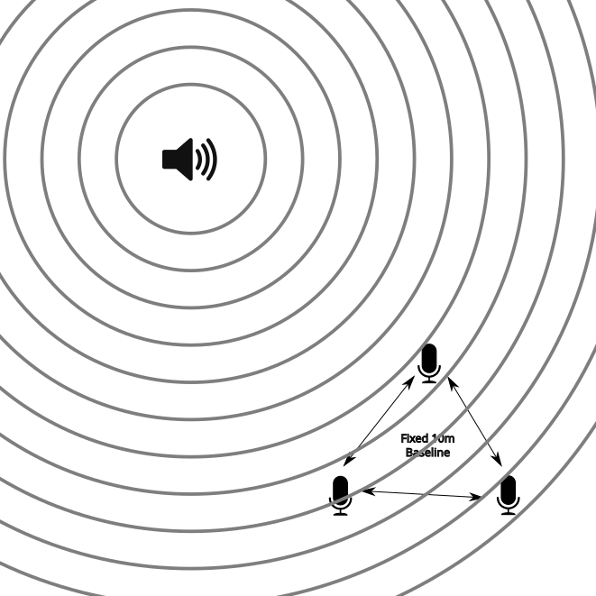

# sounds-finder
Detect sound location relative to multiple phones

This is a semi-long-term (if I have any follow-through) project. The goal is to create an android (maybe iOS too?) app
that can run on a set of phones at the same time in the same general area. With the app running, it can detect the 
location of a sound in the environment, relative to the location of the phones.

# Strategy

Top-level this will use Time Difference of Arrival of the sound at three different microphones on three phones (or other
devices?) for accurate location detection. (2-D location with 3 devices, 3-D with 4 non-coplanar devices, ambigious 2-D 
solution with just two phones.)

This requires several things:

*   Precise location of the microphones (relative for a relative solution, absolute for an absolute solution)
*   Very good time synchronization between the devices. 1 millisecond == 34cm of sound travel
*   Method for synchronizing between the devices on what the sound *is*. Pick an exact point on the sound's pressure
    wave.
*   Disambiguate sounds in a (literally) noisy environment

For a simple example, we can specify that we have a precisely measured, equilateral triangle, between three microphones.
In this setup, each side is exactly (for example only!) 10m. 

When a sound occurs it propigates outward, in all directions (usually), at the speed of sound. Because the microphones 
are at different locations, the sound wave reaches them at different times.

With the speed of sound being 343 meters per second (at 20 °C, 68 °F), we can calculate the distances to the object 
on the difference of arrival time. (insert math here)

## References

*   [Wikipedia - Trilateration](https://en.wikipedia.org/wiki/Trilateration)
*   [Wikipedia - True-range multilateration](https://en.wikipedia.org/wiki/True-range_multilateration)

# Timing

Because the sound wave is moving at 34cm every millisecond, it is critical that we get the highest possible time
tolerance.

## GPS Time 

Ideally, we could use the built-in GPS system of each phone to get nanosecond (or at least single-digit microsecond) 
accuracy in the time between stations (i.e. the microphones). However, the Android API 
([Location.getTime()](https://developer.android.com/reference/android/location/Location.html#getTime%28%29)) only 
supports millisecond accuracy. Even further, users report that it may cut off at the whole second, setting anything 
after the decimal to zero. Is this some way of acting as a 1pps? If so can a rapid query get better timing? Doubtful, 
but worth exploring.

Putting aside android, here's a nifty blog post on getting [Microsecond accruate time with a Raspberry Pi and PPS GPS](https://austinsnerdythings.com/2021/04/19/microsecond-accurate-ntp-with-a-raspberry-pi-and-pps-gps/).

## Network Time

The grand-daddy of network timing, [NTP](https://en.wikipedia.org/wiki/Network_Time_Protocol) is completely un-suitable
for this. On android it doesn't seem to be able to get much better than 30-40ms and can be *very* slow to converge on 
startup.

We also don't have a need for precise absolute time, we just need the *relative* time between the three devices to be 
synched to some arbitrary epoch. 

Between wired devices on a ethernet network, it is completely feasible to get ping times in the 100 microsecond range 
(0.1 milliseconds). If we can service simple UDP packets at the same rate/latency, we should easily be able to pull this
off. Unfortunately, wifi looks like it has much worse latencies. 

## Sound Calibration

Because each of these devices has a speaker as well as a microphone. Could we use an audio method to synchronize? Have 
each station send out a specifically formed ping wave, which is detected by the others. Back-haul communication can let 
the other stations know when it thought it was sending.

Android phones seem to be able to record 44.1kHz audio without any issues, so in theory this could enable 
synchronization to within 20 microseconds. In 20 microseconds sound can move 6.86mm, so if we can calibrate the baseline
length between the microphones this well, that might work! The bigger issues is that the speaker will probably be over 
100mm from the microphone on the same phone, so that will need to be accounted for.

# Sound Signal Matching

A job for AI???

